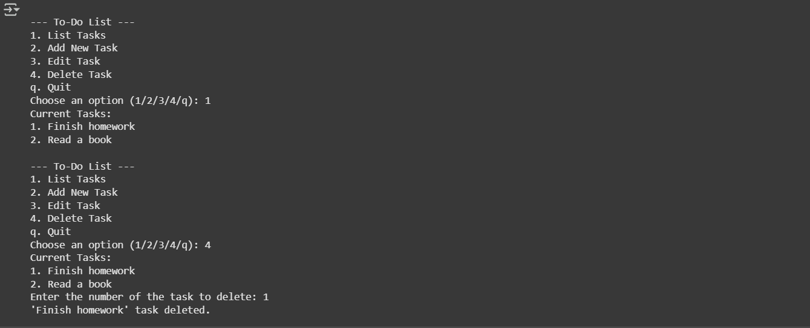
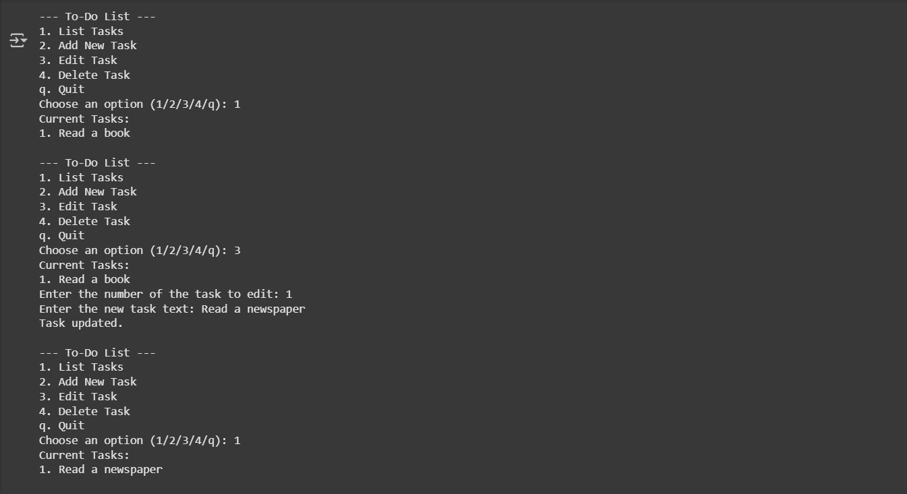
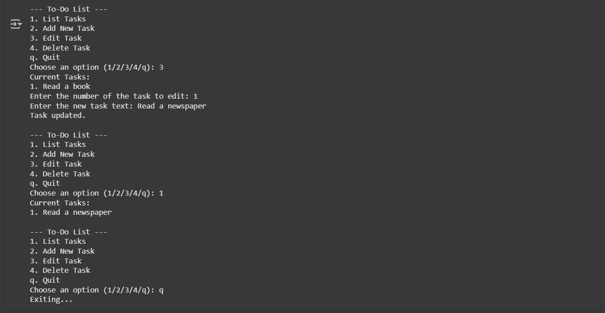

# To-Do List

**Created by: Elifnur Ozcelik**

## Description
This is a simple command-line To-Do List application developed in Python. It allows users to manage daily tasks with functionalities to add, edit, delete, and list tasks. Tasks are saved persistently in a local text file (tasks.txt), ensuring your list is retained between sessions.

- Provide a numbered display of all tasks for better task management
- Add new tasks with input validation to prevent empty entries
- Modify existing tasks by selecting the corresponding task number
- Remove tasks efficiently by specifying their list position
- Ensure data persistence by saving tasks in a local text file across sessions

## Screenshots

Here are some screenshots of the project:

  

  

  

## License

This project is licensed under the terms of the [LICENSE](LICENSE) file.

## Last Updated

August 2025
